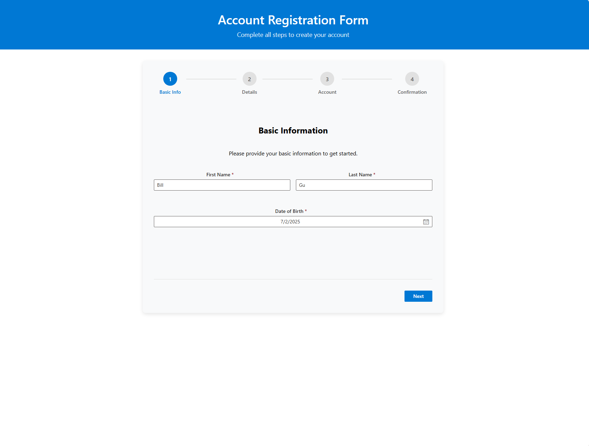

# Multi-Step Registration Form

A sophisticated, user-friendly multi-step registration form built with React, TypeScript, and Microsoft Fluent UI. This project demonstrates modern frontend development practices with a focus on user experience, accessibility, and code quality.

## 📋 Project Overview

This application features a comprehensive 4-step registration process that guides users through account creation with real-time validation, intuitive navigation, and a polished interface.

### ✨ Key Features

**🔄 Multi-Step Process:**
- **Step 1: Basic Information** - First name, last name, and date of birth
- **Step 2: Additional Details** - Country selection, gender, and optional avatar upload
- **Step 3: Account Information** - Email address and secure password
- **Step 4: Confirmation** - Review and submit registration details

**🎯 Advanced Functionality:**
- **Smart Navigation**: Step-by-step progression with validation gates
- **Interactive Step Indicator**: Visual progress tracking with clickable navigation on confirmation
- **Real-time Validation**: Instant feedback with detailed error messages
- **File Upload**: Avatar image upload with validation (file type and size)
- **Country Search**: Searchable dropdown with comprehensive country list
- **Form Persistence**: Data retained when navigating between steps
- **Success Feedback**: Confirmation page with option to register another account

## 🚀 Setup and Installation

### Prerequisites
- Node.js (version 16 or higher)
- npm package manager

### Getting Started

1. **Clone and navigate to the project:**
   ```bash
   cd bill-Payoneer-frontend-oa
   ```

2. **Install dependencies:**
   ```bash
   npm install
   ```

3. **Start the development server:**
   ```bash
   npm start
   ```

4. **Open your browser:**
   Visit [http://localhost:3000](http://localhost:3000) to view the application

5. **Run tests (optional):**
   ```bash
   npm test
   ```

6. **Build for production (optional):**
   ```bash
   npm run build
   ```

### Project Structure
```
src/
├── components/
│   └── RegistrationForm/           # Main form component
│       ├── RegistrationForm.tsx    # Container component
│       ├── RegistrationForm.css    # Styling
│       └── steps/                  # Individual step components
│           ├── BasicInfoStep.tsx   # Step 1: Basic info
│           ├── DetailsStep.tsx     # Step 2: Additional details
│           ├── AccountStep.tsx     # Step 3: Account creation
│           └── ConfirmationStep.tsx # Step 4: Review & submit
├── utils/
│   ├── types.ts                    # TypeScript interfaces
│   ├── validationSchemas.ts        # Yup validation rules
│   └── fileUtils.ts               # File upload utilities
├── constants/
│   ├── countries.ts               # Country data and utilities
│   └── gender.ts                  # Gender options
└── apis/
    └── mockApi.ts                 # Simulated API calls
```

## 📷 Step-by-Step Screenshots

### Step 1: Basic Information


### Step 2: Additional Details


### Step 3: Account Information


### Step 4: Confirmation


**Note:** When on the confirmation page, you can jump to past pages by clicking the step icon in the top bar.
